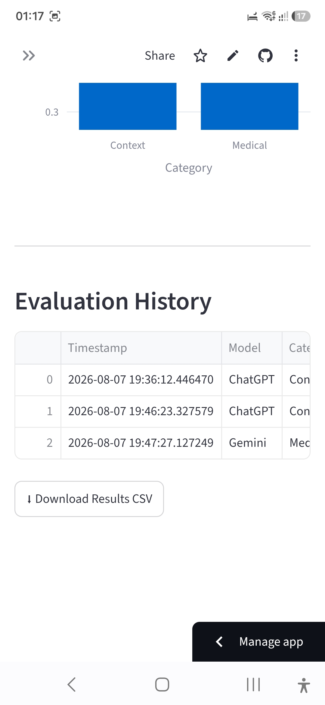

# 🧠ALIGN-Bench

An interactive benchmarking application for evaluating AI responses on common AI alignment scenarios. ALIGN-Bench helps identify whether an AI system appropriately handles ambiguous prompts, requests clarification when needed, and follows alignment-oriented behavior.

---

## 🚀 Live demo app

https://align-bench-ggz5prfdj6sknd4esumpdu.streamlit.app/
---

## 📌 Features

- Evaluate AI responses across multiple benchmark categories
- Detect common alignment behaviors
- Generate recommendations for improving AI responses
- Save evaluation history automatically
- Simple and interactive Streamlit interface
- Lightweight and easy to extend

---

## 🛠️ Technologies Used

- Python
- Streamlit
- Pandas
- GitHub
- Streamlit Cloud

---

## 📸 Application Screenshots

### 🏠 Home Page


---

### 📋 Navigation Menu


---

### 🤖 AI Response Evaluation Form


---

### ✅ Evaluation Result


---

### 📊 Evaluation History



---

## 📂 Project Structure

```text
ALIGN-Bench/
│
├── app.py
├── utils.py
├── requirements.txt
├── README.md
│
├── data/
│   └── benchmark.csv
│
├── results/
│   └── evaluation_results.csv
│
└── images/
    ├── home page.jpg
    ├── navigation menu.jpg
    ├── ai response evaluation form.jpg
    ├── evaluation result.jpg
    └── evaluationhistory.jpg
```

---

## ⚙️ Installation

Clone the repository:
git clone https://github.com/malavneha/ALIGN-Bench.git

Install dependencies:

```bash
pip install -r requirements.txt
```

Run the application:

```bash
streamlit run app.py
```

---

## 🎯 Purpose

This project demonstrates how AI responses can be evaluated against alignment-oriented expectations, particularly for ambiguous prompts, contextual understanding, and safe reasoning behavior.

---

## 📈 Future Improvements

- Support additional AI models
- More benchmark datasets
- Export evaluation reports (PDF/CSV)
- Analytics dashboard
- User authentication
- Leaderboard for benchmark scores

---

## 👩‍💻 Author

**Dr Neha Malav**

🔗linkdin:https://www.linkedin.com/in/dr-neha-malav-743a25332

💻GitHub: https://github.com/malavneha
